# Unity-Dots-WireframePlexusEffect

A Plexus like effect with glowing vertecies and connection-lines based on the wireframe of the mesh. When the vertecies move around they connect and disconnect based on the distance. Implemented with ECS, parallel running jobs and burst compile.

Had no idea how to implement this effect in Shadergraph or Effectgraph so i tried it with ecs/dots. Would love to know how to achieve this with Shadergraph or an Effectgraph!

You can set any mesh and andjust some values like how fast and far the vertecies move from their original Position or how thick the connection lines are and how streched they have to be until they get invisible.

There is still tonns of room for improvements like adding lots of options to make the the effect more variable. If you have an idea or an request please let me know.

## How to Use

### RenderPipeline

The effect does not run on heavy Shaders and can be used in **ALL RenderPipelines**. The development Unity Project was build with the URP Renderpipeline. If you want to use the HDRP Renderpipeline you just have to convert the 2 Shaders that are used in the project. Im not sure if you can automaticly upgrade them to HDRD in a HDRP-Project. But you can always rebuild them. In the URP-Project just open the shaders with the shadergraph editor and you can see how the shader is built. then open the HDRP project and rebuilt the Shader in a new Shadergraph.

### Unity Version

i built the Project with Unity 6 but i dont know in which version it will break, i will try out 2023 and 2022 and will report the results here.

### The Project Repository

After donwloading or cloning the repo, open it with the corresponding Unity version. The opne the "SampleScene" from "Assets/PlexusEffect/ExampleScene/".
In the Scene you have to make sure the "EntitySubScene" is activated (is ticked)

Then when you enter the Playmode the PlexusObjects should load and animate due to the parameters.
Now you can change the paramters, exit the PlayMode select the Gameobject "PlexeusObjectSphere" and change the parameters, then restart the playmode to what changed.

### How to import the package to your Project

here is an example on how to import the effect into a fresh project. 
### setup the PlexusEffect
- Download this Repository.
- Create a new Project
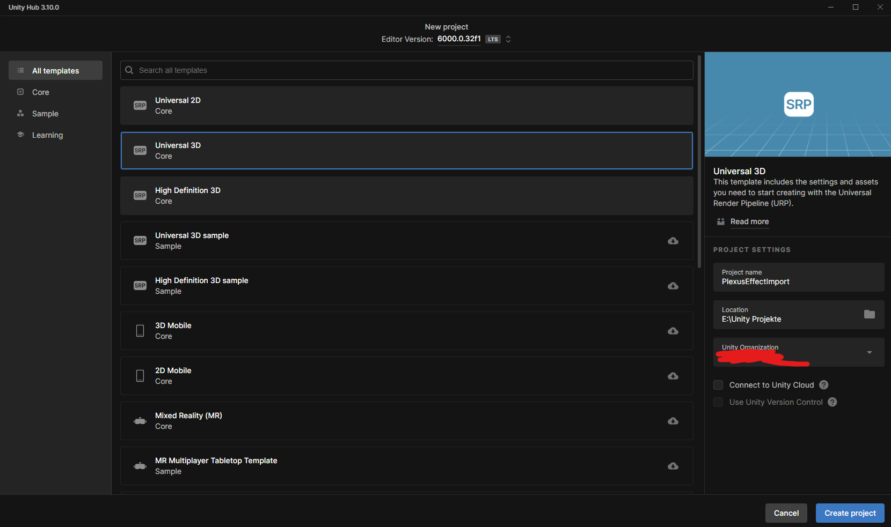
- Open The "PackageManager" window to import the needed ECS dependencies
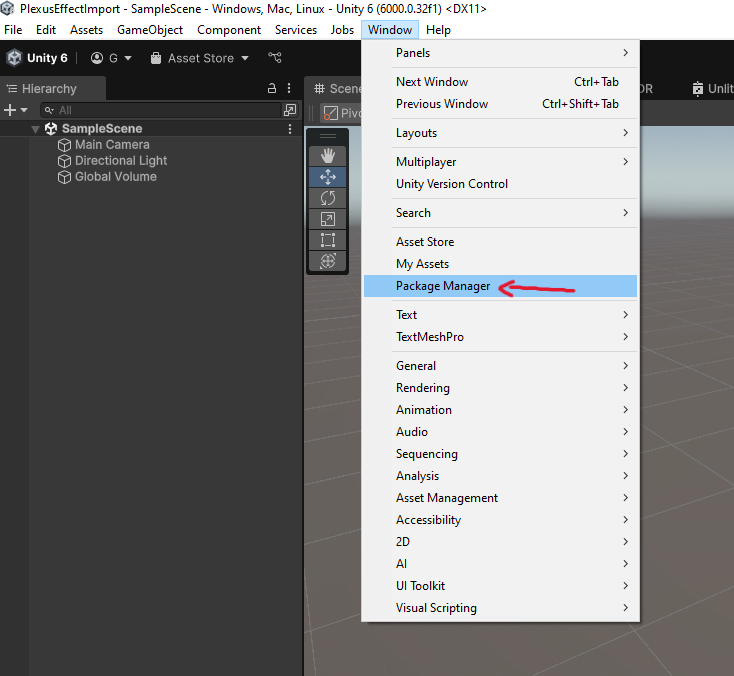
- In the "PackageManager" window, switch to the "UnityRegistry" section
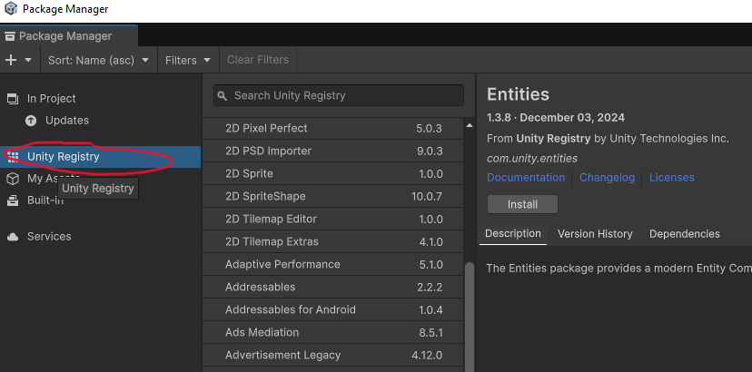
- Install the "Entities" package, which grabs all the neccessary packages for ECS 
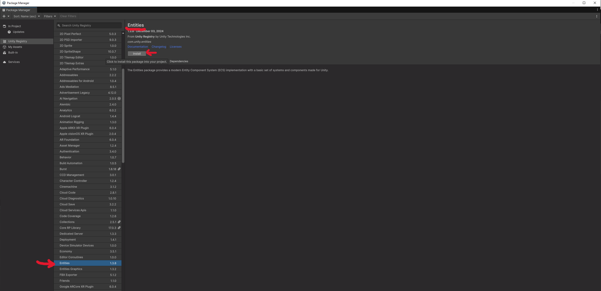
- Install the "EntitiesGraphics" package, which is needed to render meshes with ECS 
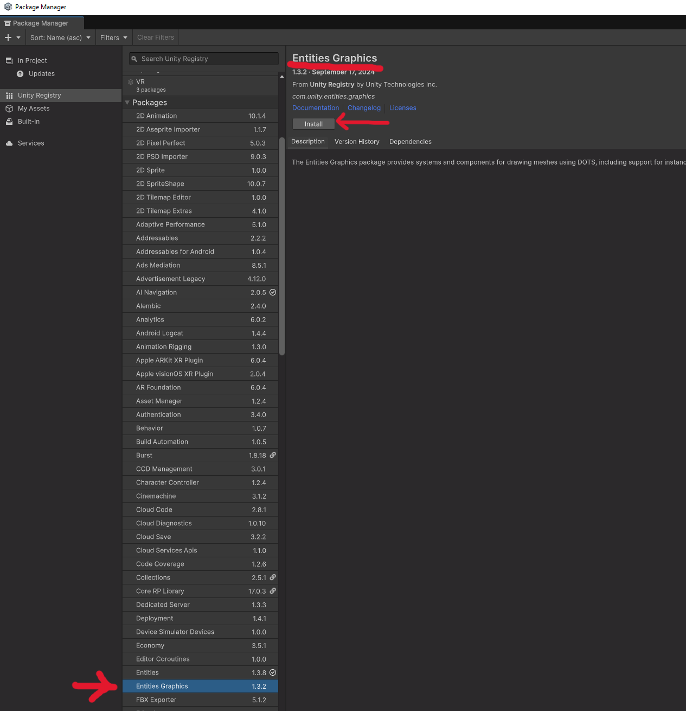
- to import the "WireframePlexusEffect" package, close the "PackageManager" and rightclick in the Project panel and click "Import Package" -> "Custom Package" 
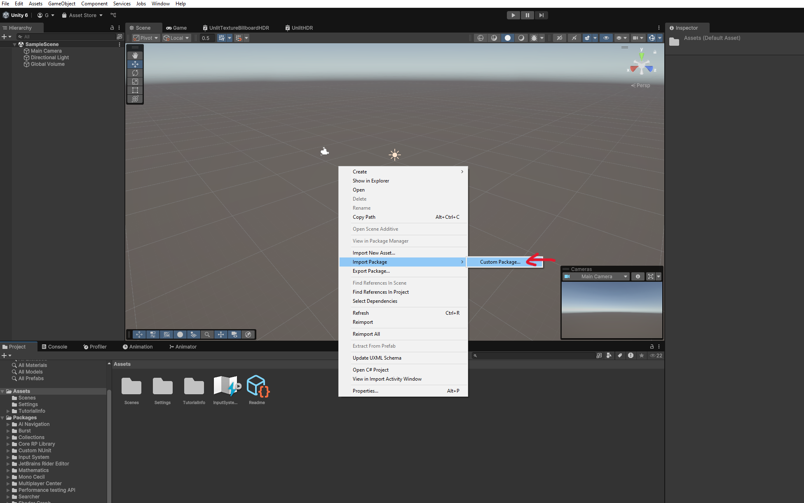
- navigate to the location where you donwloaded/cloned this repository and select the "plexusEffectPackageToImport" package from the "assets" folder, and confirm
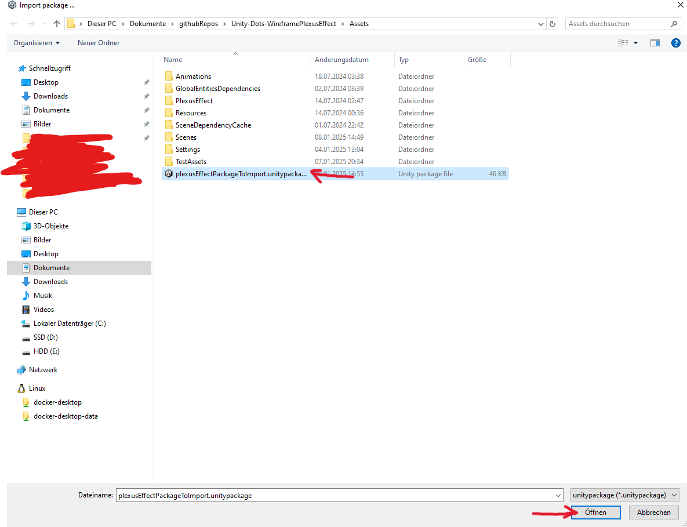
- in the import dialog click "import", this will genreate a new folder called "PlexusEffect" where you can find all the PlexusEffect realated stuff  
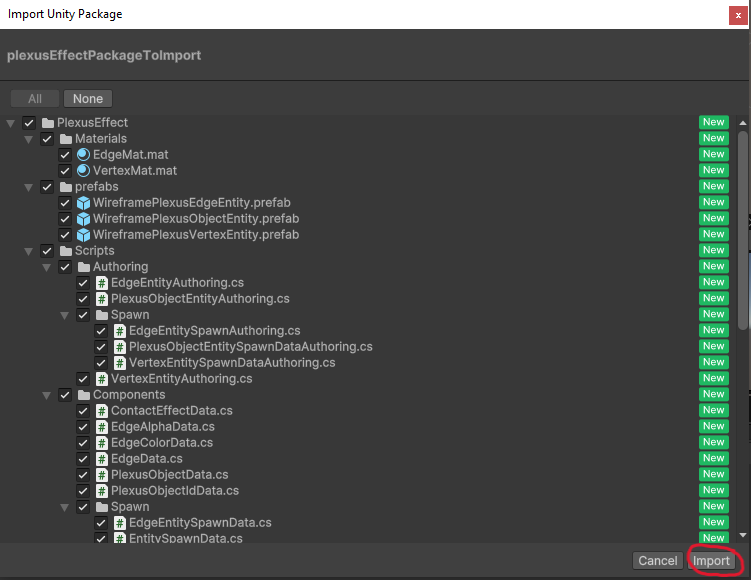
- now that that the plexusEffect is imported, lets make some effects. In order to use ECS Entites a "Subscene" is needed. So rightclick into the "Hierarchy" and create a new Subscene. The Subscene is like a Scene but for ECS Entites only, so we will fill it later with ECS life.
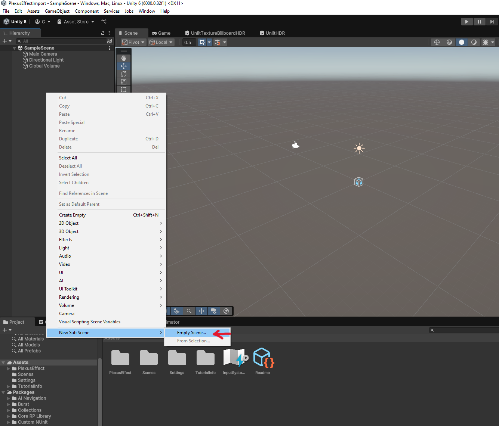
- give the Subscene a meaningfull name
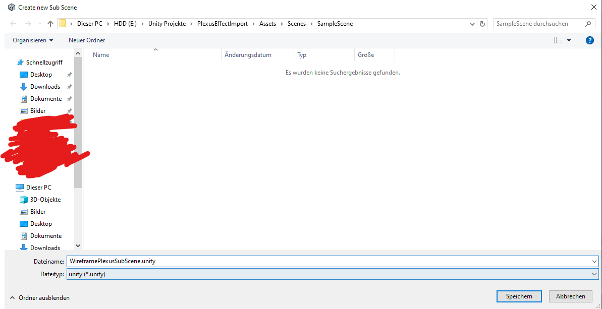
- now that the Subscene is created, make sure that it is ticked and enabled, because a subscene can also be disabled
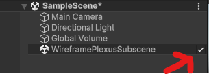
- In order to fill the Subscene with life, we have to register the Entities that we want to use later in the Subscene. To do so, navigate to PlexusEffect/prefabs/Subscene folder in your assets. 
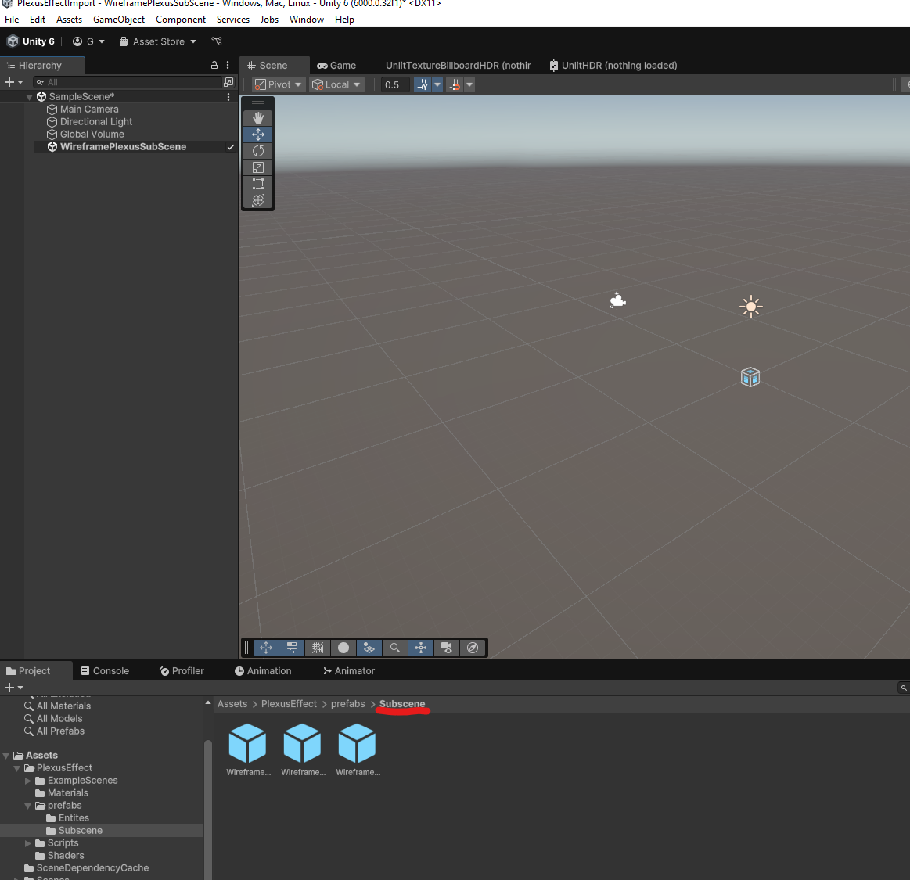
- and drag and drop all 3 "EntitySpawner"-Prefabs into the Subscene we created earlier. These will tell the Subscene how to Instantitate a new Entity instance. 
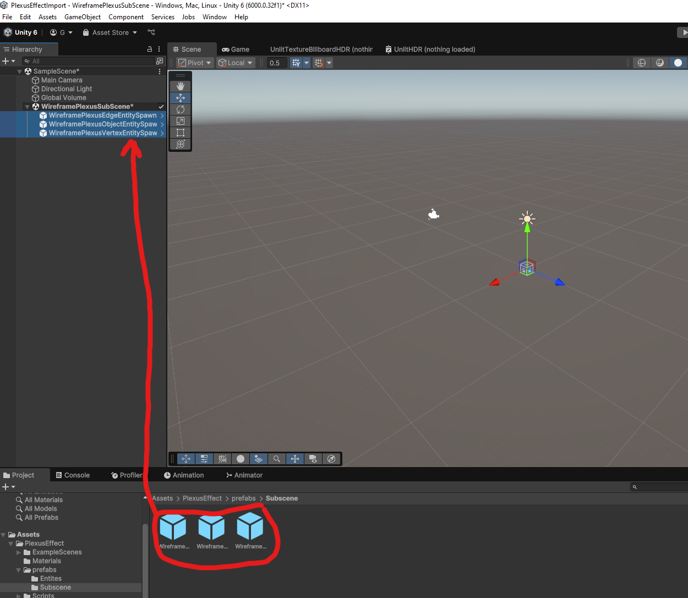

Great, now the PlexusEffect stuff is setup and ready to be used to actualy render something! 

### Use the PlexusEffect
in this example we create a simple PlexusEffect on a Unity-sphere

- In our regular Scene lets create a new Gameobject and choose the default Sphere, with rightclick into the "Hierarchy" and select GameObject->3D Object->Sphere 
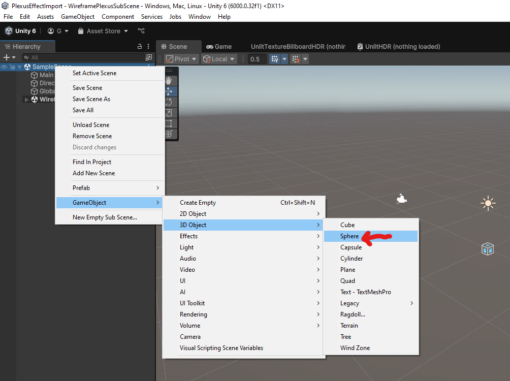

- Add the "PlexusGameobjectFromMesh" Component to the Sphere Gameobject. This Component will iterate over the MeshData and convert it to a kind of PlexusEffectMesh data that will be used by the Effect. this will happen when the scene starts and is quite a heavy calculation. for an example like this, it is fine, but for a more preformance critical setup you should consider using the "PlexusGameObjectPrecalculated" Component
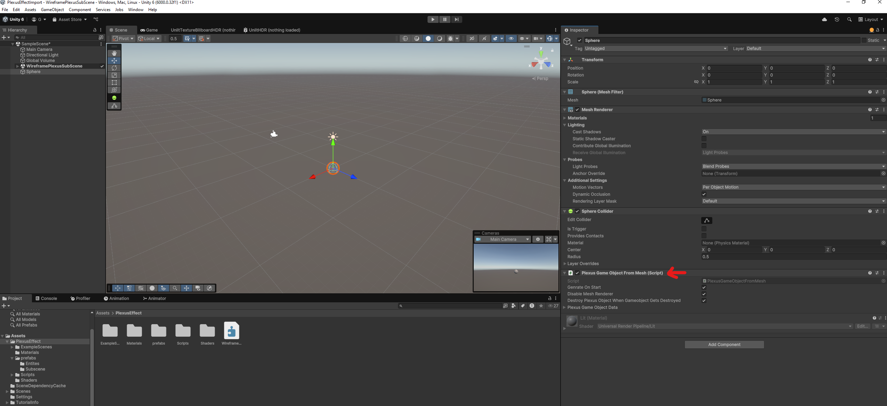

more instructions will follow in some minutes

# Example with the buildin sphere mesh

# Or you can abuse it as a Wireframe Shader, when setting the vertices to not move around

# Multi Object setup with different settings, meshes and colors

# An contact color change animation for later use in a game

# Contact animation with vertex distortion

